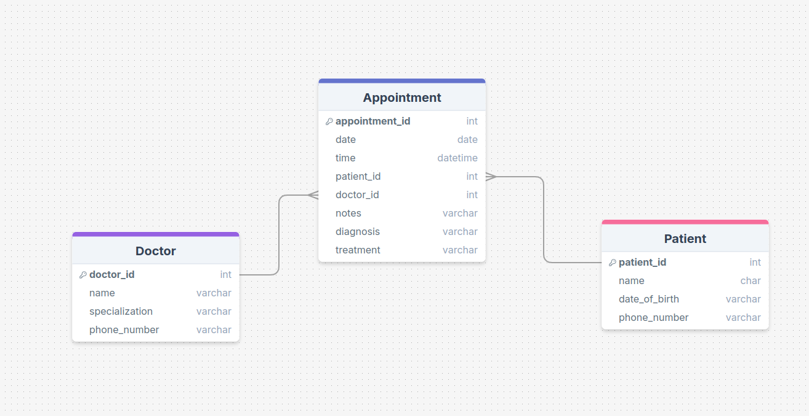
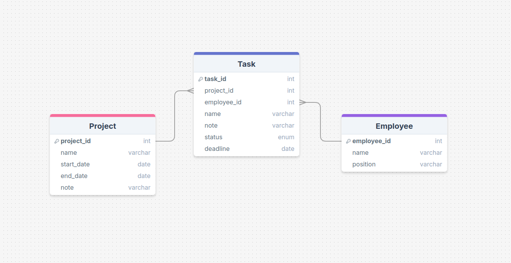
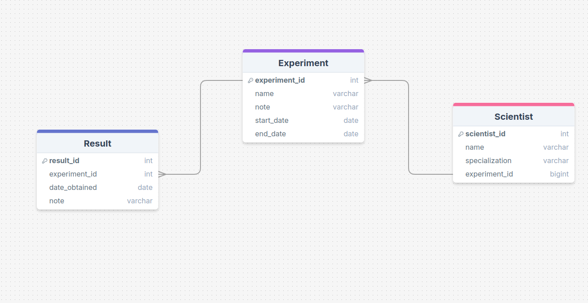
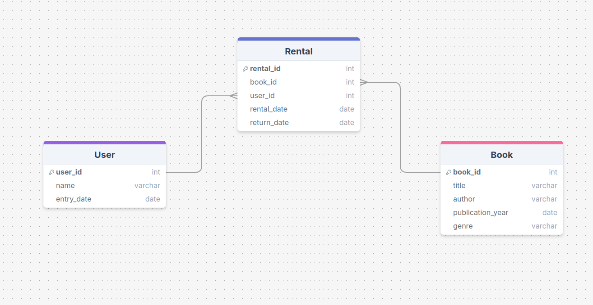

## Лабораторная работа 1

выполнено: https://drawsql.app/diagrams

### Основные термины

**Модель данных** — это абстрактное представление структуры данных и их взаимосвязей в информационной системе. Она определяет, как данные будут храниться, организовываться и манипулироваться в базе данных.

**Сущность (Entity)** — это объект или концепция, которая имеет значение в контексте предметной области и которую нужно хранить в базе данных. Например, в системе учета студентов сущностями могут быть «Студент», «Курс», «Преподаватель».

**Атрибут (Attribute)** — это характеристика или свойство сущности. Например, для сущности «Студент» атрибутами могут быть «Имя», «Фамилия», «Дата рождения».

**Связь (Relationship)** — это ассоциация между двумя или несколькими сущностями. Она описывает, как сущности взаимодействуют друг с другом. Например, связь может быть «Записан на» между сущностями «Студент» и «Курс».

**Тип связи (Relationship Type)** - определяет, сколько экземпляров одной сущности может быть связано с экземплярами другой сущности. Основные типы связей:

**1:1 (Один к одному)** — каждый экземпляр одной сущности связан с одним экземпляром другой сущности.
**1:N (Один ко многим)** — один экземпляр одной сущности связан с несколькими экземплярами другой сущности.
**M:N (Многие ко многим)** — несколько экземпляров одной сущности связаны с несколькими экземплярами другой сущности.

**ER-диаграмма (Entity-Relationship Diagram)** — это графическое представление модели данных. Она показывает сущности, их атрибуты и связи между ними, а также типы связей и ограничения. ER-диаграммы используются для проектирования и анализа баз данных.

### Вариант 13: Клиника

Задача 1: Определение модели данных для управления пациентами и приемами
Создайте модель данных для управления пациентами, врачами и приемами в клинике. Система должна учитывать пациентов, врачей и медицинские приемы.

Задача 2: Определение связей между сущностями
Определите связи между пациентами, врачами и приемами. Один врач может вести приемы нескольких пациентов, один пациент может посещать нескольких врачей.

Задача 3: Построение ER-диаграммы
Постройте ER-диаграмму для описанной модели данных с использованием PlantUML. Опишите сущности для пациентов, врачей и приемов и укажите связи между ними.

### Вариант 14: Строительная компания

Задача 1: Определение модели данных для управления проектами и сотрудниками
Создайте модель данных для управления строительными проектами, сотрудниками и заданиями. Система должна хранить информацию о проектах, задачах и сотрудниках.

Задача 2: Определение связей между сущностями
Определите связи между проектами, сотрудниками и задачами. Один проект может включать несколько задач, один сотрудник может быть назначен на несколько задач.

Задача 3: Построение ER-диаграммы
Постройте ER-диаграмму для описанной модели данных с использованием PlantUML. Опишите сущности для проектов, задач и сотрудников и укажите связи между ними.

### Вариант 15: Химическая лаборатория

Задача 1: Определение модели данных для учета экспериментов
Создайте модель данных для управления химическими экспериментами, учеными и результатами. Система должна хранить информацию о проведенных экспериментах и их результатах.

Задача 2: Определение связей между сущностями
Определите связи между учеными, экспериментами и результатами. Один ученый может участвовать в нескольких экспериментах, один эксперимент может иметь несколько результатов.

Задача 3: Построение ER-диаграммы
Постройте ER-диаграмму для описанной модели данных с использованием PlantUML. Опишите сущности для экспериментов, ученых и результатов и укажите связи между ними.

### Вариант 16: Библиотека

Задача 1: Определение модели данных для учета книг и пользователей
Создайте модель данных для управления книгами, пользователями и записями об аренде книг в библиотеке. Система должна хранить информацию о книгах, читателях и истории аренды.

Задача 2: Определение связей между сущностями
Определите связи между книгами, пользователями и арендами. Один пользователь может арендовать несколько книг, а одна книга может быть арендована несколькими пользователями.

Задача 3: Построение ER-диаграммы
Постройте ER-диаграмму для описанной модели данных с использованием PlantUML. Опишите сущности для книг, пользователей и аренды и укажите связи между ними.

