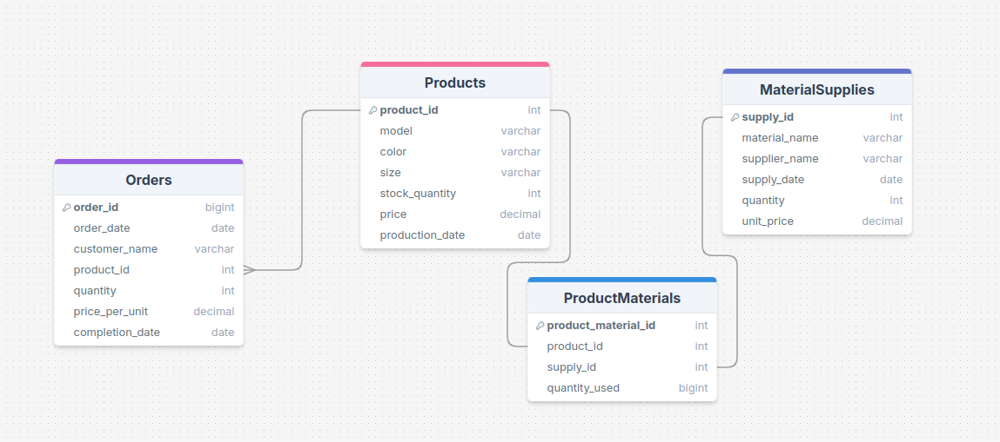

# Лабораторная работа 2

### Описание задачи

Ваша задача заключается в проектировании структуры базы данных для различных бизнес-сценариев, а также в выполнении операций с данными, используя команды DDL (Data Definition Language) и DML (Data Manipulation Language). Задания должны решаться без использования подзапросов и JOIN.

В процессе выполнения работы вам предстоит:

1. **Создать базу данных и таблицы**: Вы будете разрабатывать структуру базы данных, включая создание необходимых таблиц для хранения информации о клиентах, продуктах, заказах или других сущностях, связанных с вашей предметной областью.

2. **Наполнить таблицы данными**: Вам необходимо будет вставить записи в созданные таблицы с использованием операторов DML, чтобы подготовить базу данных к дальнейшему анализу.

3. **Выполнять операции с данными**: В ходе выполнения задач вы будете применять различные команды DML для выборки, обновления и удаления данных. Вы научитесь использовать фильтрацию, группировку, сортировку и агрегацию, чтобы извлекать и анализировать данные, что является ключевым аспектом работы с базами данных.

4. **Анализировать результаты**: Каждый из ваших запросов должен давать осмысленные результаты, которые помогут в анализе бизнес-процессов. Вы будете исследовать активность клиентов, оборачиваемость товаров и другие важные метрики.

Каждому студенту предлагается решить один вариант. Номер варианта вычисляется по формуле:

Номер варианта = ((13−1)mod 5)+1 = 3

### Вариант 3

Производственная компания занимается изготовлением и продажей различных товаров. 
Продукция поступает на склады после производства, где затем распределяется по заказам клиентов. 
Каждое изделие имеет несколько вариантов, таких как модель, цвет и размер. 
Для выполнения заказов используются материалы, которые закупаются у нескольких поставщиков. 
Необходимо отслеживать данные о произведённых товарах, заказах клиентов, закупках материалов и работе с поставщиками.

#### Задачи:

0. Парисулька



1. Создайте структуру для хранения данных о произведённых продуктах, заказах клиентов и поставках материалов. Заполните таблицы данными о продуктах и заказах.

```sql
 CREATE DATABASE DB;
```
проверить, что создалось:
```sql
\c db
```

для хранения данных о произведённых продуктах
первичный ключ, модель, цвет, размер, количество на складе, цена штучки
```sql
CREATE TABLE Products (
    product_id SERIAL PRIMARY KEY,
    model VARCHAR(50) NOT NULL,
    color VARCHAR(30) NOT NULL,
    size VARCHAR(10) NOT NULL,
    stock_quantity INT DEFAULT 0,
    price DECIMAL(10, 2) NOT NULL,
    production_date DATE NOT NULL
);
```

для хранения данных о заказах клиентов
первичный ключ, дата создания заказа, имя клиента
```sql
CREATE TABLE Orders (
    order_id SERIAL PRIMARY KEY,
    order_date DATE NOT NULL,
    customer_name VARCHAR(100) NOT NULL,
    product_id INT NOT NULL,
    quantity INT NOT NULL,
    price_per_unit DECIMAL(10, 2) NOT NULL,
    completion_date DATE,
    FOREIGN KEY (product_id) REFERENCES Products (product_id) ON DELETE CASCADE
);
```

для хранения данных о поставках материалов
первичный ключ, материал, поставщик, дата поставки, количество, цена
```sql
CREATE TABLE MaterialSupplies (
    supply_id SERIAL PRIMARY KEY,
    material_name VARCHAR(100) NOT NULL,
    supplier_name VARCHAR(100) NOT NULL,
    supply_date DATE NOT NULL,
    quantity INT NOT NULL,
    unit_price DECIMAL(10, 2) NOT NULL
);
```

```sql
CREATE TABLE ProductMaterials (
    product_material_id SERIAL PRIMARY KEY,
    product_id INT NOT NULL,
    supply_id INT NOT NULL,
    quantity_used INT NOT NULL,
    FOREIGN KEY (product_id) REFERENCES Products (product_id) ON DELETE CASCADE,
    FOREIGN KEY (supply_id) REFERENCES MaterialSupplies (supply_id) ON DELETE CASCADE
);
```

```sql
\dt
```

2. Добавьте записи о произведённых продуктах и сделанных заказах.

```sql
INSERT INTO Products (model, color, size, stock_quantity, price, production_date)
VALUES ('Model A', 'Red', 'M', 50, 100.00, '2024-11-01'),
       ('Model B', 'Blue', 'L', 30, 120.50, '2024-11-02'),
       ('Model C', 'Green', 'S', 20, 150.00, '2024-11-03'),
       ('Model D', 'Black', 'XL', 40, 99.99, '2024-11-04'),
       ('Model E', 'White', 'M', 25, 110.25, '2024-11-05');


```

```sql
INSERT INTO Orders (order_date, customer_name, product_id, quantity, price_per_unit, completion_date)
VALUES ('2024-11-01', 'Alice Johnson', 1, 2, 100.00, '2024-11-03'),
       ('2024-11-02', 'Bob Smith', 2, 1, 120.50, '2024-11-04'),
       ('2024-11-03', 'Charlie Brown', 3, 3, 150.00, '2024-11-05'),
       ('2024-11-04', 'Diana Prince', 4, 4, 99.99, '2024-11-06'),
       ('2024-11-05', 'Evan Davis', 5, 5, 110.25, '2024-11-07');

```

```sql
INSERT INTO MaterialSupplies (material_name, supplier_name, supply_date, quantity, unit_price)
VALUES ('Steel', 'Supplier A', '2024-11-01', 100, 50.00),
       ('Plastic', 'Supplier B', '2024-11-02', 200, 10.00),
       ('Rubber', 'Supplier C', '2024-11-03', 300, 5.00),
       ('Paint', 'Supplier D', '2024-11-04', 50, 20.00),
       ('Wood', 'Supplier E', '2024-11-05', 150, 15.00);
```

3. Выведите список всех произведённых продуктов, отсортировав их по дате производства.

```sql
SELECT * FROM Products
ORDER BY production_date;
```

4. Найдите все заказы, выполненные в определённый период времени.

```sql
SELECT * FROM Orders
WHERE order_date BETWEEN '2024-11-01' AND '2024-11-02';
```

5. Выведите поставки материалов, общая стоимость которых попадает в указанные границы.

```sql
SELECT * 
FROM MaterialSupplies
WHERE quantity * unit_price BETWEEN 2000 AND 5000;
```

6. Рассчитайте общую стоимость всех произведённых продуктов для каждого заказа и сохраните результаты.

```sql
SELECT 
    order_id, 
    SUM(quantity * price_per_unit) AS total_order_cost
FROM Orders
GROUP BY order_id;
```

7. Определите, сколько товаров было произведено для каждой модели и запишите результаты.

```sql
SELECT 
    model, 
    SUM(stock_quantity) AS total_produced
FROM Products
GROUP BY model;
```

8. Выведите заказы, в которых было произведено больше определённого количества единиц продукции.

```sql
SELECT * 
FROM Orders
WHERE quantity > 2;
```

9. Обновите информацию о ценах на материалы от одного из поставщиков.

```sql
UPDATE MaterialSupplies
SET unit_price = unit_price * 1.1
WHERE supplier_name = 'Supplier A';
```

10. Удалите записи о заказах, которые были выполнены более года назад.

```sql
DELETE FROM Orders
WHERE order_date < NOW() - INTERVAL '1 year';
```

11. Найдите все поставки, сделанные от определённых поставщиков.

```sql
SELECT * 
FROM MaterialSupplies
WHERE supplier_name = 'Supplier B';
```

12. Выведите первые пять записей о производственных заказах, пропустив несколько первых записей.

```sql
SELECT * 
FROM Orders
LIMIT 5 OFFSET 3;
```

13. Подсчитайте среднюю стоимость материалов для каждого заказа и сохраните результаты.

```sql
SELECT 
    material_name, 
    AVG(unit_price) AS avg_price
FROM MaterialSupplies
GROUP BY material_name;
```

14. Отсортируйте заказы по дате их выполнения.

```sql
SELECT *
FROM Orders
ORDER BY completion_date;
```

15. Выведите список поставщиков, которые выполнили наибольшее количество поставок.

```sql
SELECT 
    supplier_name, 
    COUNT(*) AS total_supplies
FROM MaterialSupplies
GROUP BY supplier_name
ORDER BY total_supplies DESC;
```

``` bash
docker run --name postgres-container \
    -e POSTGRES_USER=postgres \
    -e POSTGRES_PASSWORD=1234 \
    -p 5432:5432 \
    -d postgres:latest
```
```bash
 psql -h localhost -U postgres -d postgres
 docker exec -it postgres-container psql -U postgres

```